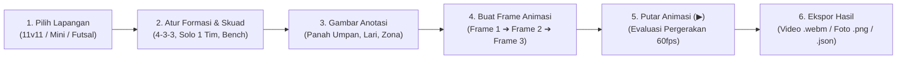

# ⚽ Bola Bundar — Papan Taktik & Animasi Interaktif

> **Aplikasi Papan Taktik & Simulasi Animasi Sepak Bola, Mini Soccer, dan Futsal Berbasis Web.**
> Dibuat dengan performa tinggi, animasi 60fps, dan dapat langsung di-*deploy* ke **GitHub Pages (`github.io`)**.

---

## 📖 Daftar Isi
- [Gambaran Umum](#-gambaran-umum)
- [Fitur Utama](#-fitur-utama)
- [Panduan Alur Penggunaan](#-panduan-alur-penggunaan)
- [Teknologi yang Digunakan](#-teknologi-yang-digunakan)
- [Panduan Memulai (Instalasi Lokal)](#-panduan-memulai-instalasi-lokal)
- [Alur Rilis & Deployment (GitHub Pages)](#-alur-rilis--deployment-github-pages)
- [Struktur Direktori](#-struktur-direktori)
- [Lisensi](#-lisensi)

---

## 🌟 Gambaran Umum

**Bola Bundar** dirancang untuk pelatih, analis video, pemain, dan penggemar sepak bola untuk merancang strategi, membuat simulasi pergerakan pemain, menggambarkan alur operan bola, dan mengekspor hasilnya dalam bentuk video animasi atau gambar resolusi tinggi tanpa memerlukan perangkat lunak berbayar.

Aplikasi ini berjalan 100% *client-side* di browser, sangat ringan, responsif untuk layar desktop maupun mobile, dan dioptimasi penuh agar animasi berjalan mulus di 60fps.

---

## ✨ Fitur Utama

### 1. 🎬 Splash Screen Pembuka 3D yang Dinamis
* **Animasi Bola Sepak 3D**: Bola sepak dengan tekstur klasik pentagon-hexagon berputar halus (*720° spin*) dan membesar ke ukuran penuh.
* **Transisi Menembus Layar (*Zoom Burst Reveal*)**: Setelah pemuatan selesai, bola membesar secara dramatis menembus layar lalu memudar halus langsung ke atas lapangan hijau.
* **Akses Cepat**: Dapat dilewati (*Skip*) dengan sekali klik, dan dapat ditonton kembali kapan saja dengan mengklik **Logo Bola Bundar ⚽** di navbar atas.

---

### 2. 🏟️ Lapangan Fleksibel & Kustomisasi Permukaan
* **Pilihan Jenis Lapangan**:
  * **Sepak Bola Penuh (11v11)** — Proporsi lapangan standar regulasi internasional.
  * **Mini Soccer (7v7 / 8v8)** — Lapangan mini soccer modern.
  * **Futsal (5v5)** — Lapangan futsal indoor dengan garis batas resmi.
* **Mode Lapangan**:
  * **Full Pitch** — Seluruh area lapangan.
  * **Half Pitch** — Mode setengah lapangan untuk latihan skema sepak pojok, tendangan bebas, atau *box defending*.
* **Pilihan Tekstur Rumput & Lapangan**:
  * **Full Green Grass** — Rumput hijau alami polos tanpa garis pola rumput (*clean tactical view*).
  * **Classic Grass Turf** — Rumput bergaris potong selang-seling ala stadion Eropa.
  * **Dark Green Turf** — Rumput hijau gelap kontras tinggi.
  * **Futsal Blue Court** — Lantai futsal vinyl biru standar kejuaraan.
  * **Parquet Wood** — Lantai kayu parket klasik indoor futsal.

---

### 3. 👥 Mode 1 Tim (Solo Drill) vs 2 Tim (Matchup)
* **Mode 1 Tim (Tanpa Lawan)**: Tombol instan untuk menyembunyikan tim lawan sehingga lapangan menjadi leluasa dan tidak terlalu padat saat menyusun skema pola serangan (*build-up shape*).
* **Beralih Tim Solo**: Cukup klik badge Home/Away untuk mengganti tim mana yang sedang tampil sendiri.
* **Mode 2 Tim**: Tampilkan kedua tim untuk simulasi skenario pertandingan lengkap.

---

### 4. 🕹️ Interaksi Pemain & Token Taktis
* **Drag & Drop Mulus**: Geser posisi token pemain dan bola ke titik mana pun secara bebas.
* **Knob Rotasi Arah Pandang 360°**: Putar pegangan (knob oranye) pada token pemain untuk menentukan arah hadap badan dan sudut pandang visual (*vision cone*).
* **Auto-Facing Run Orientation**: Pemain otomatis memutar arah badannya menghadap arah berlarinya saat animasi dijalankan.
* **Magnetic Ball Snap**: Bola otomatis menempel ke kaki pemain terdekat dengan indikator cahaya cincin magnetik saat didekatkan.
* **Tukar Posisi Instan (Player Swap)**: Cukup tarik token seorang pemain tepat ke atas pemain lain untuk menukar posisi mereka secara langsung.

---

### 5. 📐 Grid 18 Zona Taktis & Analisis Ruang
* **18-Zones Modern Football**: Membagi lapangan menjadi 18 zona analitik modern standar UEFA (analisis Pep Guardiola & Louis van Gaal).
* **Sorotan Khusus Zona 14**: Area sentral di depan kotak penalti lawan disorot dengan warna emas/amber untuk penekanan zona krusial berbahaya.
* **Pemilih Warna Zona Interaktif**: Palet warna lengkap (Kuning, Putih, Cyan, Merah, Lime, Oranye, Pink, Biru, dan Hex Custom) untuk menyesuaikan warna garis zona dengan kenyamanan mata Anda.

---

### 6. ✏️ Alat Gambar & Anotasi (Drawing Toolbar)
* **Panah Operan Bola (Passing Arrow)**: Garis panah solid penunjuk arah operan bola.
* **Jalur Lari Sprint (Running Line)**: Garis putus-putus (*dashed line*) untuk pergerakan pemain tanpa bola (*off-the-ball run*).
* **Dribble Bergelombang (Wavy Dribble Line)**: Garis bergelombang penanda aksi menggiring bola.
* **Area Taktis Persegi (Tactical Zone Box)**: Blok persegi transparan untuk menandai area perangkap *pressing* atau *pocket space*.
* **Penghapus (Eraser) & Clear**: Hapus goresan tertentu atau bersihkan seluruh coretan pada frame aktif.
* **Palet Warna Anotasi**: 6 pilihan warna kontras tinggi untuk membedakan instruksi taktik.

---

### 7. ⏱️ Keyframe Timeline & Animasi Halus (60fps)
* **Konsep Berbasis Frame**: Susun taktik bertahap (Frame 1 ➔ Frame 2 ➔ Frame 3).
* **Interpolasi Mulus (Cubic Ease-In-Out)**: Saat menekan tombol **Play (▶)**, posisi token pemain dan bola akan bergerak meluncur secara halus tanpa patah-patah.
* **Pengatur Kecepatan**: Pilihan kecepatan putar `0.5x`, `1x`, `1.5x`, dan `2x`.
* **Manajemen Frame**: Tambah Frame Baru (Add Frame), Gandakan Frame (Duplicate), Hapus Frame, serta atur durasi transisi per frame (detik).
* **Playback Scrubbing**: Indikator progress bar hijau di atas timeline menunjukkan jalannya animasi secara real-time.

---

### 8. ⚡ Pola Lari & Umpan Siap Pakai (Tactical Plays)
Disediakan preset taktik populer yang dapat dimuat dengan sekali klik melalui menu **"Pola Lari & Umpan"**:
1. **Give & Go (One-Two Wall Pass)** — Simulasi umpan pantul satu-dua dan pemain menusuk ke ruang kosong di belakang bek.
2. **Overlapping Wing-Back Run** — Simulasi bek sayap melakukan sprint lari overlap menyalip pemain sayap.
3. **Tiki-Taka Third-Man Run** — Pola operan tiga pemain (*third-man combination*) untuk membongkar pertahanan rapat.

---

### 9. 📋 Manajemen Skuad & Formasi
* **Preset Formasi Beragam**:
  * *Sepak Bola 11v11*: 4-3-3, 4-2-3-1, 4-4-2 Flat, 4-4-2 Diamond, 3-5-2, 3-4-3, 5-3-2, 5-4-1, dan variasi lainnya.
  * *Mini Soccer*: 2-3-1, 3-2-1, 2-2-2, 3-1-2, 1-3-2.
  * *Futsal*: 1-2-1 Diamond, 2-2 Box, 3-1 Pyramid, 4-0 Total Futsal.
* **Jumlah Skuad Fleksibel & Asimetris**: Mendukung jumlah pemain tidak seimbang (misalnya latihan 8 lawan 7 pemain).
* **Bangku Cadangan (Sideline Bench)**: Simpan pemain pengganti di pinggir lapangan dan masukkan ke lapangan utama kapan saja (*To Pitch*).
* **Kustomisasi Lengkap**: Ubah nama tim, warna jersey pemain kandang/tandang, warna kiper, serta nomor punggung dan nama individual pemain.

---

### 10. 🎯 Spotlight Guided Tour & Smart Auto-Collision Tooltips
* **Panduan Sorotan Tombol (*Spotlight Highlighting*)**:
  * Layar meredup presisi dengan lubang fokus (*SVG mask cutout*) tepat di atas tombol yang sedang dibahas.
  * Tombol target dilingkari cincin neon hijau zamrud yang berdenyut (*pulsing neon ring*) dengan tag `🎯 Target: [Nama Tombol]`.
  * Kartu penjelasan merinci dua aspek utama: **Fungsi Tombol** dan **Kegunaan / Manfaat Taktis**.
  * Dilengkapi tombol **Lewati (Skip)** dan **Close (✕)** yang menyimpan preferensi di `localStorage` agar tidak mengganggu pengguna.
* **Smart Auto-Collision Tooltip**:
  * Otomatis mendeteksi jarak ke tepi layar browser (`getBoundingClientRect`).
  * Tombol di navbar atas otomatis membalik tooltip ke bawah (**Auto-Flip to Bottom**) agar tidak terpotong di luar layar atas.
  * Penataan otomatis ke tepi kiri/kanan (**Horizontal Auto-Clamping**) agar tooltip tidak tembus keluar layar.
  * Tombol yang di-hover menyala terang dengan cincin hijau zamrud.

---

### 11. 💾 Ekspor & Berbagi Hasil Taktik
* **Rekam Video (.webm)**: Rekam animasi pergerakan simulasi taktik secara langsung ke dalam file video.
* **Snapshot Foto Resolusi Tinggi (Retina 2x PNG)**: Simpan tangkapan layar papan taktik dengan resolusi tajam untuk dicetak atau dijadikan bahan presentasi.
* **Simpan & Buka Proyek (.json)**: Ekspor seluruh data formasi, koordinat pemain, frame animasi, dan warna ke format file JSON, serta impor kembali kapan saja.

---

## 🚀 Panduan Alur Penggunaan



1. **Pilih Tipe Lapangan**: Klik menu di navbar atas (Sepak Bola, Mini Soccer, atau Futsal) dan pilih tekstur rumput sesuai kebutuhan.
2. **Atur Skuad**: Di sidebar kanan, pilih preset formasi awal atau gunakan tombol **Mode 1 Tim** jika ingin latihan pola tanpa lawan.
3. **Posisikan Pemain**: Geser token pemain ke posisi awal dan atur arah hadap badan menggunakan knob titik oranye.
4. **Gambar Anotasi Taktis**: Gunakan toolbar mengambang di pojok kiri atas untuk menambahkan garis umpan dan jalur lari.
5. **Buat Animasi**:
   * Di timeline bawah, klik **Add Frame** (atau duplikat frame).
   * Pada Frame 2, geser pemain dan bola ke posisi tujuan berikutnya.
   * Tekan tombol **Play (▶)** untuk melihat simulasi bergerak halus!
6. **Ekspor & Bagikan**: Klik tombol **Record** untuk merekam video animasi atau **PNG** untuk menyimpan foto strategi.

---

## 🛠️ Teknologi yang Digunakan

* **Framework**: [React 18](https://react.dev/) + [TypeScript](https://www.typescriptlang.org/)
* **Bundler & Dev Server**: [Vite](https://vitejs.dev/)
* **Canvas Engine (60fps)**: [react-konva](https://github.com/konvajs/react-konva) & [Konva.js](https://konvajs.org/)
* **State Management**: [Zustand](https://github.com/pmndrs/zustand)
* **Styling & UI Design**: [Tailwind CSS](https://tailwindcss.com/)
* **Icons**: [Lucide React](https://lucide.dev/)
* **Media Recording**: HTML5 Canvas Capture & MediaRecorder API

---

## 💻 Panduan Memulai (Instalasi Lokal)

### Prasyarat
Pastikan Anda telah menginstal **Node.js** (versi 18 ke atas disarankan) dan **npm** di komputer Anda.

### 1. Clone Repositori
```bash
git clone https://github.com/username/bola-bundar.git
cd bola-bundar
```

### 2. Pasang Dependensi
```bash
npm install
```

### 3. Jalankan Server Pengembangan (Local Dev)
```bash
npm run dev
```
Buka browser Anda dan akses tautan lokal:
```
http://localhost:5173/
```

### 4. Build untuk Produksi
```bash
npm run build
```
File hasil kompilasi yang siap disajikan di server web statis akan berada di folder `dist/`.

---

## 📦 Alur Rilis & Deployment (GitHub Pages)

Proyek ini telah dikonfigurasi dengan alur kerja otomatis **GitHub Actions** (`.github/workflows/deploy.yml`) yang akan melakukan *build* dan *deploy* otomatis ke GitHub Pages setiap kali Anda membuat atau memperbarui **Git Tag Rilis** (misalnya `v1.0.0`).

### Cara Membuat Rilis Tag Baru:
```bash
# 1. Pastikan semua perubahan sudah di-commit
git add .
git commit -m "feat: deskripsi pembaruan fitur"

# 2. Buat tag versi release baru
git tag -a v1.0.0 -m "Release v1.0.0: Full Tactical Board with Guided Tour & Tooltips"

# 3. Push commit dan tag ke GitHub
git push origin main
git push origin --tags
```
Setelah tag di-*push*, GitHub Actions akan otomatis mengompilasi aplikasi dan memublikasikannya ke GitHub Pages Anda.

---

## 📁 Struktur Direktori

```
bola-bundar/
├── .github/
│   └── workflows/
│       └── deploy.yml          # Otomasi build & deploy ke GitHub Pages
├── public/
│   └── vite.svg
├── src/
│   ├── assets/                 # Aset gambar / ikon statis
│   ├── components/
│   │   ├── canvas/             # Rendering canvas Konva (lapangan, token, bola, garis)
│   │   │   ├── BallNode.tsx
│   │   │   ├── DrawingLayer.tsx
│   │   │   ├── PitchBackground.tsx
│   │   │   ├── PlayerTokenNode.tsx
│   │   │   └── TacticalCanvas.tsx
│   │   ├── sidebar/            # Sidebar pengelola skuad & inspektor token
│   │   │   ├── PlayerInspector.tsx
│   │   │   └── SquadManager.tsx
│   │   ├── timeline/           # Bar timeline keyframe animasi & menu pola
│   │   │   └── TimelineBar.tsx
│   │   ├── toolbar/            # Navigasi atas & toolbar alat gambar
│   │   │   ├── DrawingToolbar.tsx
│   │   │   └── TopNavbar.tsx
│   │   └── ui/                 # Komponen modal panduan, splash, & tooltip
│   │       ├── GuidedTour.tsx   # Panduan interaktif dengan spotlight ring
│   │       ├── SplashScreen.tsx # Splash screen animasi bola 3D membesar
│   │       └── Tooltip.tsx      # Tooltip pintar dengan deteksi benturan layar
│   ├── hooks/
│   │   └── useTacticalPlayback.ts # Hook interpolasi tweening 60fps
│   ├── store/
│   │   └── useTacticsStore.ts  # Zustand store pusat seluruh state taktik
│   ├── types/
│   │   └── tactics.ts          # Definisi tipe TypeScript
│   ├── utils/
│   │   ├── exportUtils.ts      # Utilitas ekspor video webm, png, dan json
│   │   ├── formations.ts       # Database puluhan preset formasi tim
│   │   ├── pitchGeometry.ts    # Perhitungan koordinat proporsi lapangan
│   │   └── tacticalPlays.ts    # Logika keyframe pola One-Two, Overlap, dll
│   ├── App.tsx                 # Komponen utama aplikasi
│   ├── index.css               # Styling global Tailwind & keyframe animasi
│   └── main.tsx                # Entry point React
├── index.html                  # Template HTML utama
├── package.json
├── tailwind.config.js
├── tsconfig.json
└── vite.config.ts
```

---

## 📄 Lisensi

Proyek ini dirilis di bawah lisensi [MIT](LICENSE). Silakan gunakan, modifikasi, dan kembangkan secara bebas untuk kebutuhan latihan tim, riset sepak bola, ataupun portofolio Anda.

⚽ **Selamat meracik strategi dan mencetak kemenangan bersama Bola Bundar!**
