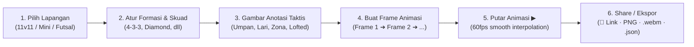

# ⚽ Bola Bundar — Papan Taktik Digital Kelas Dunia


> **🇮🇩 ID:** Papan taktik digital interaktif untuk pelatih sepak bola, mini soccer, dan futsal kelas dunia. Animasi multi-frame 60fps, bola 3D fisika, alat analitik taktik elit, dan berbagi taktik instan lewat share link.
>
> **🇬🇧 EN:** A world-class interactive digital tactical board for football, mini soccer, and futsal coaches. 60fps multi-frame animation, 3D physics ball, elite tactical analytics, and instant share-link sharing.

---

## ✨ Fitur Unggulan

| Fitur | Deskripsi |
|---|---|
| ⚽ **3 Mode Lapangan** | 11v11 Football · 7v7 Mini Soccer · 5v5 Futsal — tiap mode punya formasi & preset eksklusif |
| 🎬 **Animasi 60fps** | Multi-frame keyframe dengan interpolasi tweening halus, loop tak terbatas |
| ⚽ **Bola 3D Fisika** | Bola berputar realistis dengan pola panel Telstar, crest emas, rolling physics akurat |
| 🎨 **8 Alat Gambar** | Pass Arrow, Curved Pass, Lofted Pass 3D, Run, Dribble, Tactical Zone, Eraser, Select |
| 📐 **Grid 20 Zona** | Overlay *Juego de Posición* — 5 koridor + 20 zona, alert overload otomatis |
| 🛡️ **Rest Defense Analyzer** | Kotak bounding box hijau/merah + badge struktur 3+2 real-time |
| ⏱️ **Futsal 4-Second Rule** | Countdown clock interaktif + suara peluit otomatis (mode futsal) |
| 🔲 **Area Aksi Taktis (Action Zones)** | Kotak area tanggung jawab (Overlap, Underlap, Cover, Press, Channel Run, Paralela) dengan lencana & panah vektor |
| ⏱️ **Staggered Run Timing** | Delay waktu sprint pemain (0.0s - 2.0s) untuk pergerakan bertahap dan decoy run realistis |
| 📋 **Lembar Taktik Matchday (Print/PDF)** | Cetak formasi A4, matriks bola mati (corner, freekick, wall), dan catatan pelatih untuk ruang ganti |
| 🎛️ **Floating Scrubber Capsule** | Bilah pemutar media mengambang dengan slider scrubber presisi (mm:ss.s) dan tombol navigasi |
| 🔗 **Share Link** | Encode taktik ke URL hash terkompresi — buka link langsung siap ▶ putar |
| 🎯 **Guided Tour** | Spotlight ring interaktif dengan panduan fitur step-by-step |
| 💾 **Export Multi-Format** | PNG 2x Retina · Video .webm · Proyek .json · Import .json · Print A4 |
| 🌐 **Bilingual** | Interface penuh Bahasa Indonesia / English (toggle di navbar) |

---

## 🗺️ Panduan Cepat



### Langkah Penggunaan:

1. **Pilih Tipe Lapangan** — Klik menu di navbar atas, pilih *Football 11v11*, *Mini Soccer 7v7*, atau *Futsal 5v5*.
2. **Atur Skuad** — Pilih preset formasi di sidebar kanan, atau gunakan Mode 1 Tim untuk latihan pola.
3. **Posisikan Pemain** — Drag token ke posisi target, atur arah badan dengan knob oranye.
4. **Gambar Anotasi** — Gunakan toolbar mengambang kiri: panah umpan, kurva, lofted pass 3D, jalur lari, zona taktis.
5. **Buat Animasi** — Klik *Add Frame*, pindahkan pemain & bola, lalu tekan **▶ Play**.
6. **Analitik Real-time** — Aktifkan overlay Grid 20 Zona (📐), Rest Defense (🛡️), atau 4s Clock (⏱️) dari HUD.
7. **Share / Ekspor** — Klik 🔗 *Share Link* untuk salin URL instan, atau ekspor ke PNG/video/JSON.

---

## 🔗 Share Link — Bagikan Taktik Instan

Share Link memungkinkan Anda berbagi formasi, frame animasi, dan konfigurasi lengkap hanya dengan satu URL — **tanpa backend, tanpa server, tanpa file**.

### Cara Kerja:

```
Klik 🔗 Share Link (menu File di navbar)
         ↓
Data taktik → JSON → LZ-compress → base64 URI-safe
         ↓
URL: https://your-app.com/#data=N4IgZg9gJgph...
         ↓
Otomatis tersalin ke clipboard ✅

Penerima buka URL di browser
         ↓
App deteksi #data= di URL hash
         ↓
Decompress → loadProjectData() → hash dibersihkan
         ↓
Banner: "🔗 Taktik berhasil dimuat! Klik ▶ untuk putar."
```

### Keunggulan:
- **Kompresi LZ-string** — ~5× lebih kecil dari JSON mentah (formasi 11v11 + 3 frame ≈ 2–3 KB di URL)
- **Zero server** — Tidak ada backend, data murni di URL hash
- **Langsung putar** — Penerima buka link → tinggal klik ▶
- **Fallback** — Jika clipboard diblok browser, URL dibuka di tab baru untuk disalin manual

---

## 📐 Analitik Taktik Kelas Dunia

### Grid Juego de Posición 20 Zona 📐
Toggle dari tombol **📐** di Strategy HUD. Tersedia 3 mode:
- **Off** — Tidak ada overlay
- **5 Koridor** — Garis vertikal pembagi (2 half-space berwarna cyan)
- **20 Zona** — Divider amber full 20 zona + **alert merah** jika >2 pemain di koridor yang sama (overload detection)

### Rest Defense Analyzer 🛡️
Toggle dari tombol **🛡️** di HUD:
- **Kotak hijau** — Struktur 3+2 ideal (3 pemain belakang + 2 screening)
- **Kotak merah** — Pertahanan saat transisi terlalu terbuka / tidak terstruktur
- **Badge "3+2"** — Indikator numerik struktur pertahanan real-time

### Futsal 4-Second Rule Clock ⏱️
Hanya tersedia di mode **Futsal**. Toggle dari tombol **⏱️** di HUD:
- Tap untuk mulai/stop countdown 4.0 detik
- Warna berubah: hijau → kuning → merah seiring hitungan mundur
- Bunyi **peluit otomatis** saat menyentuh 0.0 detik

---

## 🎨 Alat Gambar Taktis

| Ikon | Alat | Fungsi |
|---|---|---|
| 🖱️ | **Select** | Pilih/hapus elemen gambar yang sudah dibuat |
| ➡️ | **Pass Arrow** | Panah solid — jalur umpan langsung |
| ↗️ | **Curved Pass** | Kurva parabola — crossing sayap / umpan lob |
| 🌬️ | **Lofted Pass (3D Arc)** | Arc curam tinggi + bola naik secara fisika selama playback |
| → | **Player Run** | Garis putus-putus — jalur lari tanpa bola |
| 〜 | **Dribble** | Garis gelombang — carrier bola |
| ▭ | **Tactical Zone** | Kotak transparan — highlight area strategis |
| ⌫ | **Eraser** | Klik gambar yang sudah ada untuk menghapus |

**Warna tersedia:** Amber · Putih · Merah · Biru · Cyan · Hijau

---

## ⚽ Mode Lapangan & Formasi

| Mode | Pemain | Contoh Formasi |
|---|---|---|
| **Football 11v11** | 10+GK vs 10+GK | 4-3-3, 4-2-3-1, 3-5-2, 4-4-2, 5-3-2, 3-4-3, 4-1-4-1 |
| **Mini Soccer 7v7** | 6+GK vs 6+GK | 2-3-1, 3-2-1, 2-2-2, 3-1-2, 1-3-2 |
| **Futsal 5v5** | 4+GK vs 4+GK | 1-2-1 Diamond, 2-2 Box, 3-1 Pyramid, 4-0 Total |

### Preset Animasi Futsal — 5 Pola Kelas Dunia:

| Preset | Konsep | Deskripsi Singkat |
|---|---|---|
| **Wall Pass** | One-Two Klasik | Kombinasi dua sentuhan di ruang sempit |
| **Paralela** | Sideline Run | Operan sejajar garis tepi membongkar flank |
| **Diagonal 45°** | Rotasi Diagonal | Pivot turun tarik bek, Ala masuk diagonal ke kotak |
| **Pisada** | Step-Over Decoy | Runner melintas bola (tanpa sentuh) untuk menarik pressing lawan |
| **Corta-Luz** | Pressing Trap | Dua pemain memotong jalur umpan, pivot tutup GK |

---

## 🎬 Animasi & Ekspor

### Multi-Frame Animation
- Tambah / duplikat / hapus frame di timeline bawah
- Setiap frame menyimpan posisi pemain, bola, dan anotasi gambar secara independen
- **Interpolasi tweening** otomatis antar frame (easing cubic)
- **Loop** toggle untuk presentasi berkelanjutan tanpa henti

### Ekspor

| Format | Deskripsi |
|---|---|
| 📸 **PNG 2x Retina** | Snapshot frame aktif resolusi tinggi untuk cetak/presentasi |
| 🎥 **Video .webm** | Rekam animasi langsung dari canvas |
| 💾 **Proyek .json** | Ekspor semua frame, pemain, konfigurasi lapangan |
| 📂 **Import .json** | Buka kembali proyek yang tersimpan |
| 🔗 **Share Link** | URL terkompresi LZ — berbagi instan tanpa file attachment |

---

## 🛠️ Teknologi

| Teknologi | Versi | Fungsi |
|---|---|---|
| [React](https://react.dev/) + [TypeScript](https://www.typescriptlang.org/) | 18 + 5 | Framework & type safety |
| [Vite](https://vitejs.dev/) | 5 | Bundler & dev server ultra-cepat |
| [react-konva](https://github.com/konvajs/react-konva) | — | Canvas engine 60fps (HTML5 Canvas) |
| [Zustand](https://github.com/pmndrs/zustand) | — | State management minimal & performant |
| [Tailwind CSS](https://tailwindcss.com/) | 3 | Utility-first styling |
| [Lucide React](https://lucide.dev/) | — | Icon library |
| [lz-string](https://github.com/pieroxy/lz-string) | — | Kompresi URL untuk Share Link |
| HTML5 MediaRecorder API | — | Rekam video canvas ke .webm |

---

## 💻 Instalasi Lokal

### Prasyarat
**Node.js v18+** dan **npm** terinstal.

### 1. Clone
```bash
git clone https://github.com/username/bola-bundar.git
cd bola-bundar
```

### 2. Install
```bash
npm install
```

### 3. Dev Server
```bash
npm run dev
# → http://localhost:5173/
```

### 4. Build Produksi
```bash
npm run build
# Output di folder dist/
```

---

## 📦 Deployment — GitHub Pages

Otomatis via **GitHub Actions** setiap kali Git Tag baru di-push:

```bash
git add .
git commit -m "feat: deskripsi fitur"
git tag -a v1.6.0 -m "Release v1.6.0"
git push origin main --tags
```

---

## 📁 Struktur Direktori

```
bola-bundar/
├── .github/workflows/deploy.yml
├── src/
│   ├── components/
│   │   ├── canvas/
│   │   │   ├── BallNode.tsx              # Bola 3D fisika + elevasi lofted pass
│   │   │   ├── DrawingLayer.tsx          # 8 alat gambar termasuk lofted-pass arc
│   │   │   ├── PositionalGridOverlay.tsx # Grid 20 Zona + Rest Defense + 4s Clock
│   │   │   ├── TacticalCanvas.tsx        # Canvas utama multi-layer
│   │   │   └── TacticalStrategyHUD.tsx   # HUD quick toggle 📐🛡️⏱️
│   │   ├── toolbar/
│   │   │   ├── DrawingToolbar.tsx        # Toolbar gambar + Lofted Pass tool
│   │   │   └── TopNavbar.tsx             # Navbar + 🔗 Share Link button
│   │   ├── sidebar/
│   │   │   ├── PlayerInspector.tsx
│   │   │   └── SquadManager.tsx
│   │   ├── timeline/TimelineBar.tsx
│   │   └── ui/
│   │       ├── GuidedTour.tsx            # Spotlight guided tour
│   │       ├── SplashScreen.tsx
│   │       └── Tooltip.tsx
│   ├── hooks/
│   │   └── useTacticalPlayback.ts        # Animasi 60fps + lofted pass elevation arc
│   ├── i18n/
│   │   ├── translations.ts               # Bilingual ID + EN keys
│   │   └── useTranslation.ts
│   ├── store/
│   │   └── useTacticsStore.ts            # Zustand store (grid, defense, 4s state)
│   ├── types/tactics.ts
│   ├── utils/
│   │   ├── exportUtils.ts                # PNG, video, JSON export
│   │   ├── formations.ts                 # Database formasi per mode
│   │   ├── pitchGeometry.ts
│   │   ├── shareLink.ts                  # 🔗 LZ-string encoder/decoder share URL
│   │   ├── soundEffects.ts
│   │   ├── tacticalPlays.ts              # 5 preset animasi futsal kelas dunia
│   │   └── tacticalStrategies.ts
│   ├── App.tsx                           # Auto-load share link on startup + banner
│   └── main.tsx
├── package.json
└── vite.config.ts
```

---

## 📄 Lisensi

Proyek ini dirilis di bawah lisensi [MIT](LICENSE). Silakan gunakan, modifikasi, dan kembangkan untuk kebutuhan latihan tim, riset sepak bola, atau portofolio Anda.

---

⚽ **Selamat meracik strategi, bagikan taktik via link, dan cetak kemenangan bersama Bola Bundar!**
